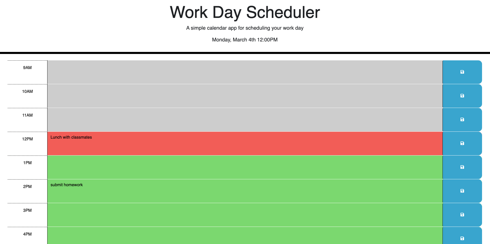
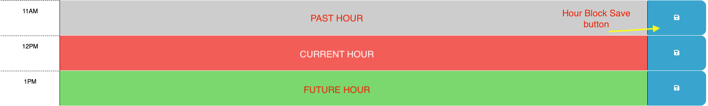
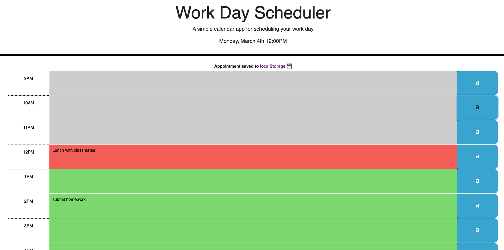
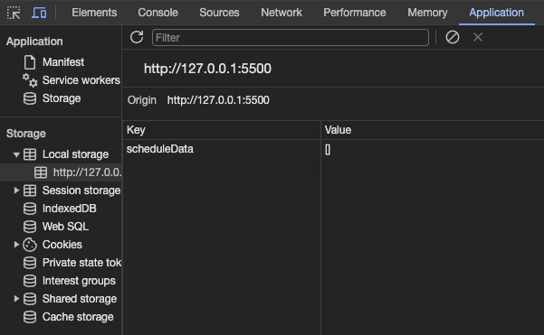
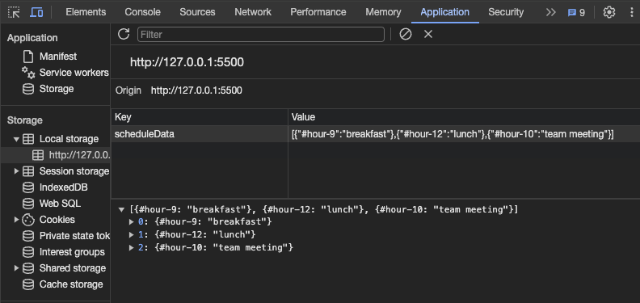

# Work Day Scheduler

## Description

This project was created for users who want to have an hourly look at their schedule during a typical 9a-5p work day. The project allows users to add and edit their day's schedule and provides a visually easy way to determine the current hour in addition to past and future hours.

## Installation

N/A

## Usage

Navigate to https://dgomie.github.io/work-day-calendar/.

On the page loading, the program will display the current date and time and populate the hour block cards. Each card consists of an hour label, a text area, and a save button. Based on the current time of day, the text area will be different colors. 
* Grey represents times in the past. 
* Red represents the current hour. 
* Green represents times in the future.

Click on the text area to input any event, appointment, or reminder. Once complete, click the save button to save the text for that specific hour block to local storage. A message at the top of the schedule will confirm that the event was saved. After three seconds the message will disappear. 

To make any changes to an hour block, click the text area again to edit the text, and click the save button once again to save the changes. 

If this is the first time loading the page, an empty 'scheduleData' array will be created and saved to local storage without the need for user input. 

All saved changes afterward will append to the scheduleData array. On the page refreshing, the data in local storage will automatically load to the designated hour block and display the saved text.

## Credits

Github user [Xandromus](https://github.com/Xandromus): [Starter Code Repo](https://github.com/coding-boot-camp/crispy-octo-meme)

## License

Please refer to the LICENSE in the repo.
